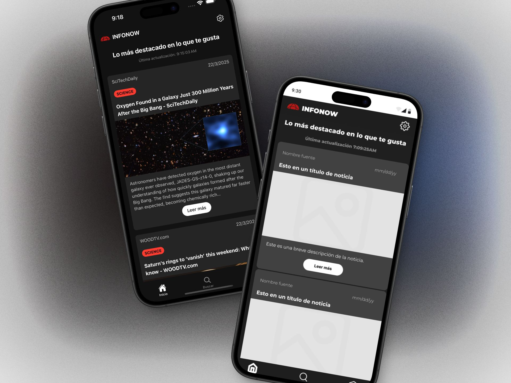
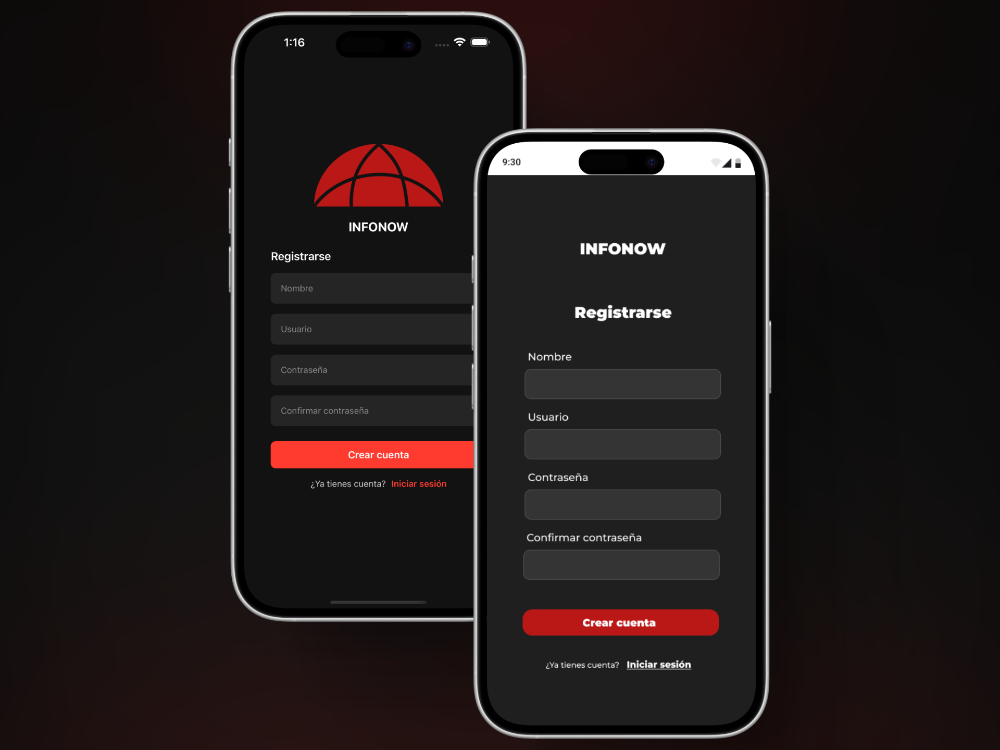
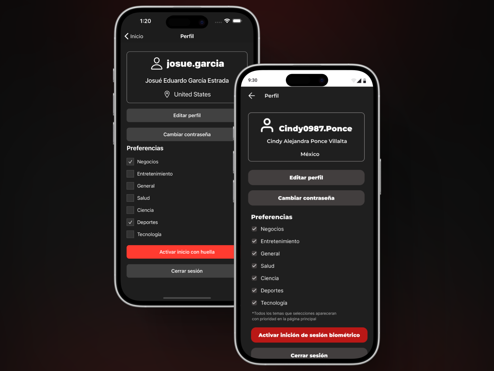
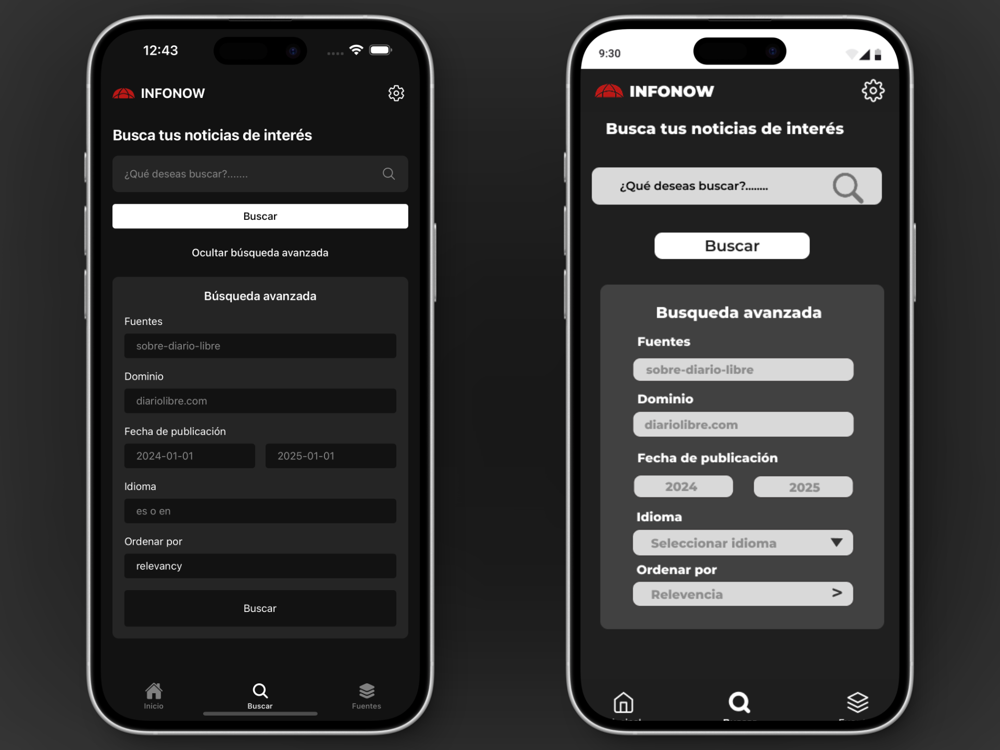
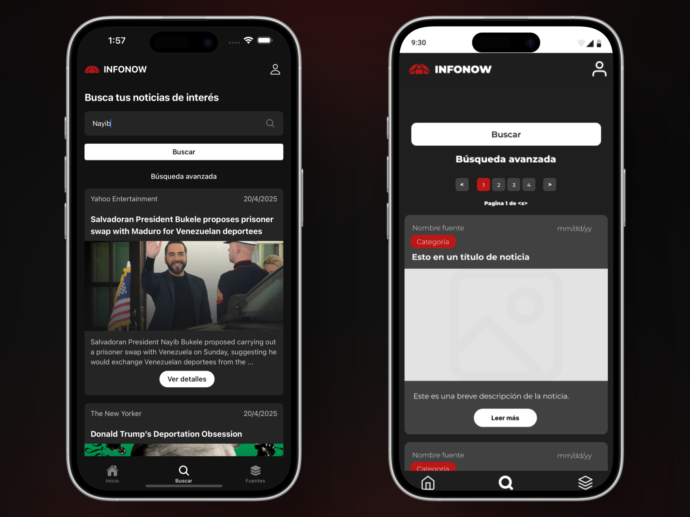
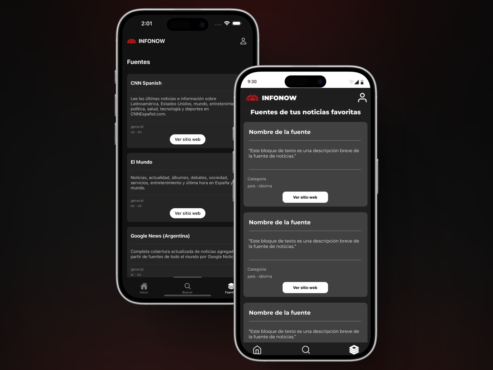

# 📱 InfoNow - Noticias en Tiempo Real

## 📋 Descripción
**InfoNow** es una aplicación móvil desarrollada en **React Native** que permite a los usuarios acceder a noticias en tiempo real de diversas categorías. La aplicación consume la API de **NewsAPI** para obtener información actualizada y presenta una interfaz intuitiva y amigable.


## 🗃️ Características Principales

### 🔐 Autenticación y Gestión de Usuarios
- **Inicio de Sesión:** Sistema de login completo para acceder a la aplicación.
- **Registro:** Creación de nuevas cuentas de usuario con contraseña.
- **Autenticación Biométrica:** Acceso rápido mediante TouchID o FaceID.

### 📰 Funcionalidades de Noticias
- **Categorización:** Acceso a noticias por diferentes categorías temáticas.
- **Noticias Locales:** Visualización de noticias según la ubicación geográfica del usuario.
- **Vista Detallada:** Interfaz rediseñada para leer noticias completas con opción de visitar el sitio original.
- **Paginación:** Sistema de navegación por páginas en las tres pantallas principales (Home, Buscar y Fuentes).

### ⚙️ Personalización
- **Panel de Configuración:** Interfaz unificada para:
  - Edición de perfil
  - Cambio de contraseña
  - Configuración de autenticación biométrica
  - Selección de categorías favoritas

### 🧭 Navegación
- **Sistema Completo:** Implementación de navegación fluida usando TabNavigator y StackNavigator.

## 🛠️ Tecnologías Utilizadas
- **Frontend:**
  - [React Native](https://reactnative.dev/docs/getting-started) - Framework para desarrollo móvil multiplataforma
  - [Expo](https://docs.expo.dev/guides/overview/) - Plataforma para simplificar el desarrollo React Native
  - [React](https://reactjs.org/docs/getting-started.html) - Biblioteca JavaScript para interfaces de usuario
  - [JavaScript](https://developer.mozilla.org/es/docs/Web/JavaScript/Guide) - Lenguaje de programación

- **Navegación:**
  - [React Navigation](https://reactnavigation.org/docs/getting-started) - Solución de navegación para React Native

- **Gestión de Estado:**
  - [Redux](https://redux.js.org/) - Contenedor de estado predecible
  - [React Redux](https://react-redux.js.org/) - Integración de Redux con React

- **Almacenamiento:**
  - [Async-Storage](https://reactnative.dev/docs/asyncstorage) - Sistema de almacenamiento asíncrono
  - [Expo Secure Store](https://docs.expo.dev/versions/latest/sdk/securestore/) - Almacenamiento seguro para datos sensibles

- **Características Nativas:**
  - [Expo Local Authentication](https://docs.expo.dev/versions/latest/sdk/local-authentication/) - Autenticación biométrica
  - [Expo Location](https://docs.expo.dev/versions/latest/sdk/location/) - Acceso a la ubicación del usuario

- **UI/UX:**
  - [React Native Gesture Handler](https://docs.swmansion.com/react-native-gesture-handler/) - API para gestos táctiles
  - [React Native Reanimated](https://docs.swmansion.com/react-native-reanimated/) - Animaciones fluidas
  - [React Native Vector Icons](https://github.com/oblador/react-native-vector-icons) - Iconos vectoriales
  - [React Native Toast Message](https://github.com/calintamas/react-native-toast-message) - Notificaciones toast
  - [Expo Linear Gradient](https://docs.expo.dev/versions/latest/sdk/linear-gradient/) - Gradientes lineales

- **APIs:**
  - [NewsAPI](https://newsapi.org/) - API principal de noticias
  - [NewsData](https://newsdata.io/documentation) - API para noticias localizadas por *expo-location*

- **Herramientas de Desarrollo:**
  - [NPM](https://docs.npmjs.com/about-npm) - Gestor de paquetes
  - [React Native Dotenv](https://github.com/goatandsheep/react-native-dotenv) - Manejo de variables de entorno

## 📲 Instrucciones de Instalación y Ejecución
1. **Clonar el repositorio:**
   ```sh
   git clone https://github.com/JosueGarcia-UDB/news-react-native.git
   ```
2. **Acceder al directorio del proyecto:**
   ```sh
   cd news-react-native
   ```
3. **Instalar dependencias:**
   ```sh
   npm install
   ```
4. **Ejecutar la aplicación en Expo:**
   ```sh
   npx expo start
   ```
5. **Escanear el código QR** con la aplicación Expo Go en tu dispositivo móvil o usar un emulador.

> **📝 Nota:** Para el inicio de sesión biométrico se recomienda usar un dispositivo físico y utilizar la app [Expo Go](https://play.google.com/store/apps/details?id=host.exp.exponent&hl=en&pli=1)

## 👨‍💻 Integrantes del Equipo
| Nombre de Integrante | Carnet |
|----------------------|--------|
| Josué Eduardo García Estrada | GE240098 |
| Eduardo Alfredo Ramírez Torres | RT240549 |
| José Fernando Rodríguez Escamilla | RE240134 |
| Roberto Arturo Duarte Mejía | DM240115 |
| Jeremy Edenilson Flores Portillo | FP240479 |
| Oscar Daniel Soto Jovel | SJ241841 |

## 🎨 Prototipos en Figma
Puedes visualizar los prototipos de la aplicación en el siguiente enlace:  
[🔗 Diseño en Figma](https://www.figma.com/design/6mJQfWIKFHCvByxAiT74Q0/MockUps-DPS441-ProyectoCatedra?node-id=0-1&p=f&t=ggfYOnz2XPxVjgoB-0)

## 📸 Capturas de Pantalla
A continuación, se presentan algunas capturas de la aplicación donde se muestra el resultado y el diseño inicial en Figma:

<div align="center">

### Pantalla de Login


### Pantalla de Registro


### Pantalla de Configuración


### Pantalla de Inicio


### Pantalla de Búsqueda


### Pantalla de Fuentes


</div>

## 🔄 Problemas Conocidos y Soluciones
- La sincronización entre la solicitud de permisos de localización y el modal de configuración inicial puede causar problemas para cargar noticias locales. Como solución parcial, la categoría "General" aparece preseleccionada por defecto.

🚀 ¡Ya puedes disfrutar de InfoNow! 📱
